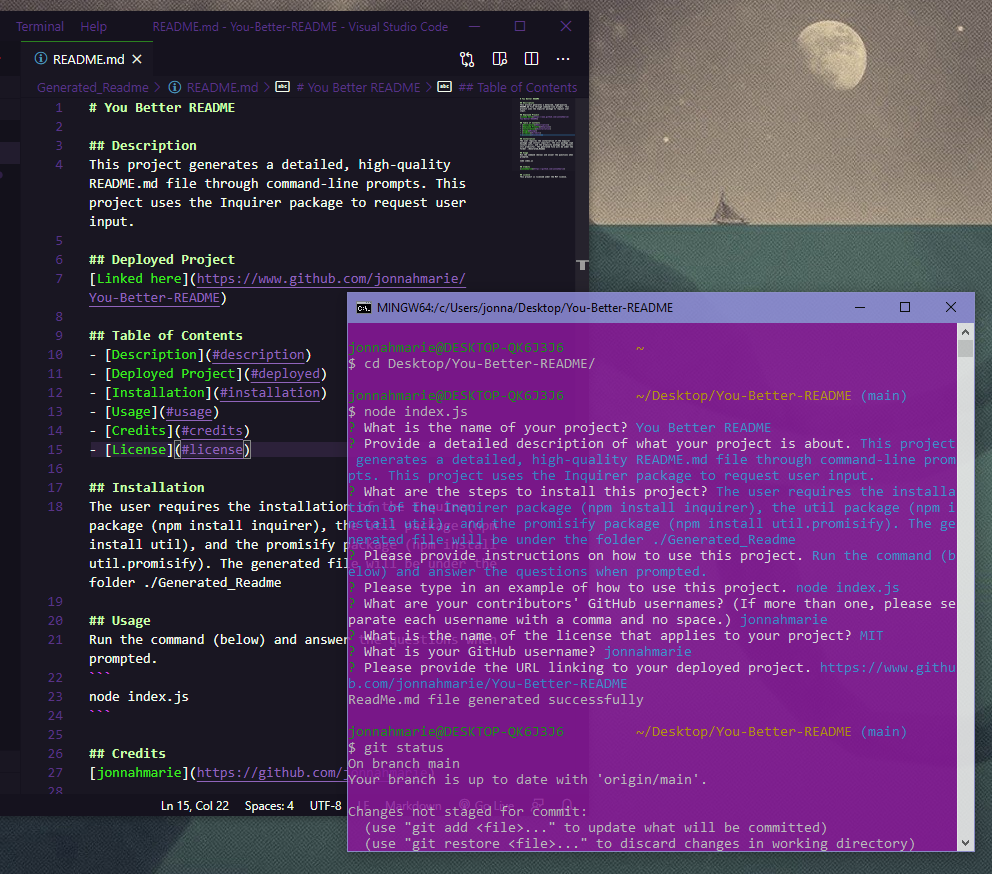

# You Better README
    
## Description
This project generates a detailed, high-quality README.md file through command-line prompts. This project uses the Inquirer package to request user input.

## Deployed Project
[Linked here](https://www.github.com/jonnahmarie/You-Better-README)

## Table of Contents
- [Description](#description)
- [Deployed Project](#deployed)
- [Installation](#installation)
- [Usage](#usage)
- [Credits](#credits)
- [License](#license)

## Installation
The user requires the installation of the Inquirer package (npm install inquirer), the util package (npm install util), and the promisify package (npm install util.promisify). The generated file will be under the folder ./Generated_Readme

## Usage
Run the command (below) and answer the questions when prompted.
```
node index.js
```
[Video Demo Link](https://drive.google.com/file/d/17xP4uo3DEzEXq6p47L-txAITOa1HVjyM/view?usp=sharing)



## Credits
[${creditGitName}](https://github.com/${creditGitName})


## License
This project is licensed under the MIT license.
   